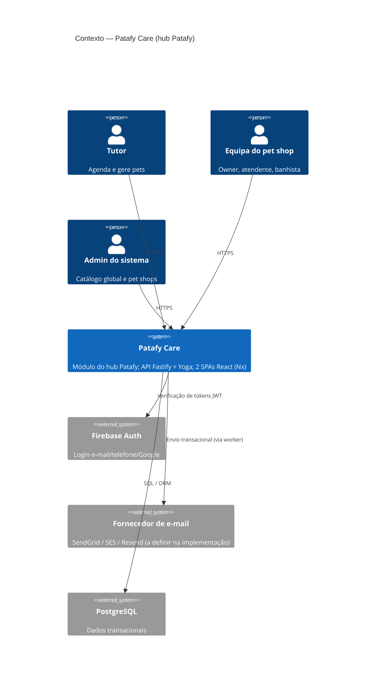
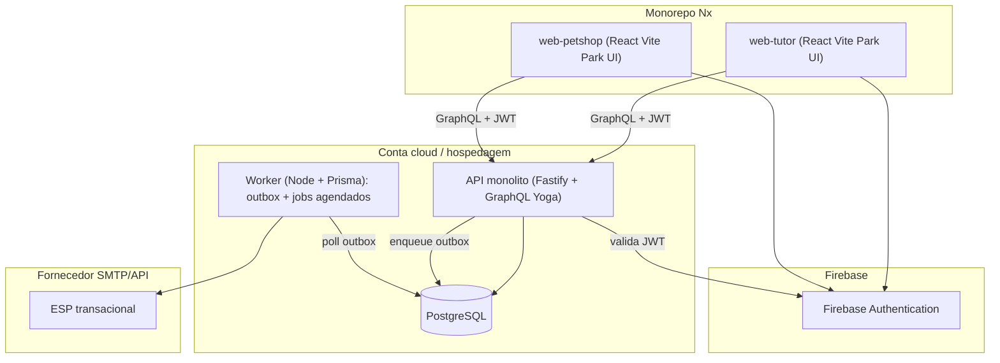
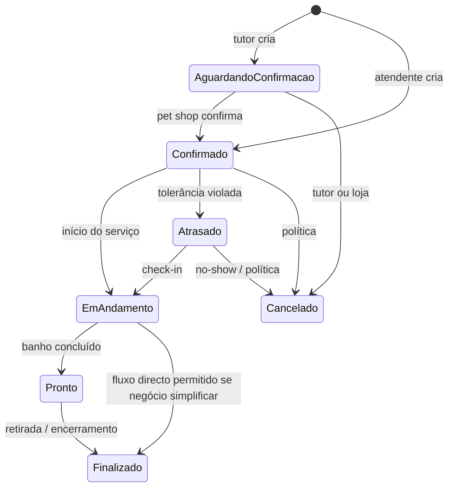

# Documento de Arquitetura — Patafy Care

Este documento materializa decisões técnicas derivadas do **PRD** e do **Modelo de Domínio**, no formato esperado pelo **BMad Method** (cadeia de especificação: PRD → arquitetura → épicos/histórias). Os títulos de nível 2 (`##`) delimitam secções autocontidas para eventual *shard* em ficheiros por secção.

---

## Sumário executivo

- **Hub:** **Patafy** — hub de aplicações; no MVP contém apenas o módulo **Patafy Care**.
- **Módulo (escopo deste documento):** **Patafy Care** — plataforma multi-tenant para tutores agendarem serviços em pet shops, com painel B2B, catálogo global administrado pelo sistema, pacotes como créditos e notificações transacionais por **e-mail** no MVP.
- **Estilo de sistema:** **API monólito** (Node/TypeScript) com **GraphQL**; **dois front-ends** distintos (tutor vs pet shop) no **mesmo monorepo Nx**; PostgreSQL como fonte de verdade; Firebase Authentication; padrão **outbox** para e-mail.
- **Stack fechada (MVP):** ver **ADR-001** (back: **Fastify** + **GraphQL Yoga** + **Prisma**) e **ADR-007** (Nx + `web-tutor` + `web-petshop`).

---

## Rastreabilidade PRD / modelo de domínio

| Origem | Implica arquitetura |
| --- | --- |
| RF01–RF05, RNF03 | Identidade Firebase + perfis `TutorProfile` / `PetshopUserProfile`; CPF único; RBAC por `roles[]`; auditoria `RegistroOperacional`. |
| RF04, premissa catálogo global | Módulo `catalogo-global` com políticas de escrita só para admin sistema; leitura partilhada. |
| RF06–RF09, estados canónicos | Serviços com variantes e duração; motor de agenda sem sobreposição por banhista; máquina de estados explícita e idempotência no débito de pacote em **Em andamento**. |
| RF07–RF08, RF10 | Disponibilidade e remarcação; regras de notificação em alterações de agenda com banhos marcados; eventos RF10 → fila/outbox. |
| RNF01–RNF04 | PWA/mobile-first; orçamento de latência; encriptação em trânsito e em repouso para dados sensíveis; isolamento lógico por `petshop_id`. |
| Modelo de domínio §1–3 | Bounded contexts e esquema relacional; `NotificacaoOutbox`; `obs_internas` por pet shop em JSON; `PacoteItemDebito`; `PetTutorConvite`; `Pet.deleted_at`. |

---

## Contexto do sistema (C4 — nível 1)



---

## Arquitetura de contentores (C4 — nível 2)



**Papéis dos contentores**

- **`web-tutor` (React + Vite + Park UI):** aplicação **exclusiva** do tutor; cliente GraphQL (p.ex. urql ou Apollo) com token Firebase (`Authorization: Bearer`).
- **`web-petshop` (React + Vite + Park UI):** aplicação **exclusiva** da equipa do pet shop (owner, atendente, banhista); mesmo contrato GraphQL, *queries*/*mutations* filtradas por RBAC.
- **API (monólito):** servidor **Fastify** com **GraphQL Yoga** (p.ex. `POST /graphql`); schema e *resolvers* organizados por **bounded context**; **Prisma** para acesso a PostgreSQL; RBAC em *plugins* / `context` do Yoga + serviços de domínio; transações Prisma incluem escrita na outbox quando o RF10 aplicar.
- **Worker:** processa `NotificacaoOutbox` (estado `pendente` → `enviado` / `falha` com retries exponenciais e *dead letter* manual). **No mesmo processo (ou *cron* acoplado),** executa *jobs* periódicos que dependem do tempo, p.ex. **cancelamento automático por atraso** (RF08.5): consulta agendamentos em estado compatível, compara `data_hora_inicio` + tolerância configurada, aplica transição para `Cancelado` (ou estado definido no PRD) dentro de transação e regista auditoria. Mantém o MVP simples sem fila externa obrigatória; evolui para SQS/Pub-Sub se o volume exigir.
- **PostgreSQL:** multi-tenant lógico; integridade referencial; índices para agenda (`petshop_id`, `banhista_id`, intervalo temporal).

---

## Stack tecnológica

| Camada | Tecnologia | Notas |
| --- | --- | --- |
| Monorepo | **Nx** | Orquestra builds, cache e *tasks*; partilha de `packages/*` entre apps. |
| Front tutor | **React + Vite + Park UI** (`apps/web-tutor` ou nome equivalente no Nx) | SPA/PWA; mobile-first (RNF01); só fluxos B2C. |
| Front pet shop | **React + Vite + Park UI** (`apps/web-petshop`) | SPA/PWA; painel B2B; **deploy separado** do tutor (dois *artefactos*). |
| Runtime API | **Node.js** + **TypeScript** | — |
| Servidor HTTP | **Fastify** | Rotas de saúde, `.ics`, *plugin* Yoga; *hooks* globais (auth, logging). |
| GraphQL | **GraphQL Yoga** | Servidor GraphQL integrado no Fastify; *envelop* para métricas, *rate limit*, etc. |
| ORM / migrações | **Prisma** | `schema.prisma` alinhado ao modelo de domínio; `prisma migrate`; `PrismaClient` por request ou instância controlada. |
| Base de dados | **PostgreSQL** 15+ | Tipos UUID, `jsonb`, `timestamptz`. |
| Auth | **Firebase Authentication** | Google + e-mail/senha; *custom claims* opcionais para `system_admin`. |
| E-mail | ESP a definir (SendGrid, SES, Resend) | Worker Node + Prisma; templates versionados. |
| Infra | Contentores Linux + PostgreSQL gerido | CI: Nx affected + testes; segredos em gestor de secrets. |

---

## Registos de decisão de arquitetura (ADRs)

### ADR-001 — Back-end: Fastify + GraphQL Yoga + Prisma + PostgreSQL

- **Contexto:** API monólito em TypeScript; contrato GraphQL; modelo relacional já descrito no domínio; desempenho e simplicidade operacional.
- **Decisão:** **Fastify** como servidor HTTP; **GraphQL Yoga** como camada GraphQL oficialmente integrável com Fastify; **Prisma** como ORM e ferramenta de migrações sobre **PostgreSQL**.
- **Consequências:** *Plugins* Fastify para autenticação, CORS (duas origens front em produção), *rate limiting*; Yoga `context` com `prisma`, utilizador Firebase resolvido e *tenant*; validação de *inputs* com Zod (ou equivalente) nas mutations; uma única base de código de API partilhada pelo worker (importar serviços/outbox) ou worker como *app* Nx separada no mesmo repo.
- **Alternativas recusadas para o MVP:** NestJS (mais *opinionated* e peso de *framework*); FastAPI (ecossistema Python desalinhado com os fronts TS).

### ADR-002 — Autenticação e autorização

- **Decisão:** **Firebase Auth** como IdP; API valida JWT (audience/project ID). Autorização por **perfil de domínio** carregado da BD (`TutorProfile`, `PetshopUserProfile` + `roles`).
- **Consequências:** Sincronização na primeira autenticação bem-sucedida (*upsert* `User` por `firebase_uid`). Operações B2B exigem `petshop_id` coerente com o perfil. *Queries* e *mutations* de admin sistema protegidas por role explícita (*plugin* Fastify / *middleware* de autorização no Yoga).

### ADR-003 — Notificações: padrão transactional outbox

- **Decisão:** Escrever linhas em `NotificacaoOutbox` na mesma **transação Prisma** (`$transaction`) que muda estado do agendamento quando o RF10 aplicar; worker assíncrono envia e-mail.
- **Consequências:** Consistência eventual controlada; idempotência no worker (chave natural: `agendamento_id` + `tipo` + versão de evento ou `id` único).
- **Riscos mitigados:** Perda de e-mail se a API responder 200 antes do envio — a transação garante persistência do intent.

### ADR-004 — Multi-tenant lógico

- **Decisão:** Isolamento por coluna **`petshop_id`** em todas as entidades operacionais do pet shop; validação no **contexto GraphQL** (e serviços) que injeta e verifica o tenant a partir do utilizador autenticado; Prisma com *where* explícito ou extensão que reforce `petshop_id` em operações B2B.
- **Consequências:** Consultas sempre filtradas; testes de regressão para fugas de tenant. Tutor: dados de pets e agendamentos visíveis através de relações, nunca por “vínculo” directo tutor–loja.

### ADR-005 — Auditoria operacional

- **Decisão:** `RegistroOperacional` append-only escrito pela camada de aplicação em comandos críticos (mudança de estado, remarcação, troca de banhista, `pago`, cancelamentos).
- **Consequências:** Volume de escrita moderado; consultas com filtros por `petshop_id` e período.

### ADR-006 — GraphQL em vez de REST

- **Contexto:** O cliente precisa de dados relacionados (agenda + serviços + pets) com poucas idas e voltas; a equipa domina TypeScript e beneficia de tipos gerados a partir do schema.
- **Decisão:** Expor o contrato público da API como **GraphQL**; evolução do schema com disciplina (deprecações, changelog).
- **Consequências:** *DataLoader* ou eager loading cuidadoso para evitar N+1; limites de **profundidade** e **complexidade**; política de paginação (*relay* style ou `limit`/`cursor` em listas). Ficheiros binários (ex.: `.ics`) via **rota HTTP dedicada** assinada ou autenticada, fora do schema GraphQL (ver fluxo export).
- **Alternativa:** REST + OpenAPI — útil se integrações de terceiros exigirem verbos HTTP simples sem SDK GraphQL.

### ADR-007 — Monorepo Nx: duas aplicações front separadas

- **Contexto:** Tutor e pet shop têm jornadas, permissões e *shell* UI distintos; o PRD descreve roles diferentes.
- **Decisão:** Um **monorepo Nx** com duas apps **React + Vite + Park UI**: **`web-tutor`** (apenas tutor) e **`web-petshop`** (equipa da loja); partilha opcional de `packages/ui`, `packages/shared-types` (ex.: enums, *codegen* GraphQL gerado a partir do schema da API).
- **Consequências:** Dois *pipelines* de deploy e duas origens CORS na API; *GraphQL Code Generator* pode correr por app ou uma vez para `packages/graphql-client` consumido pelas duas apps.
- **Alternativa:** SPA única com *lazy routes* por área — mais simples em deploy, mas mistura bundles e superfície de auth; rejeitada em favor de separação clara.

---

## Módulos da API GraphQL (alinhamento com bounded contexts)

Organização sugerida por **pastas de domínio** no projecto da API (cada uma com *schema* parcial ou *resolvers* agrupados registados no Yoga):

| Módulo | Responsabilidade | Tipos / operações (exemplos) |
| --- | --- | --- |
| `auth` / `users` | Sincronização de utilizador, contexto de sessão | `User`, `me`, `syncUser` |
| `catalogo-global` | CRUD tipos, raças, portes, pelagens | `TipoAnimal`, `Raca`, mutations admin |
| `petshops` | Loja, configuração, bloqueios, staff | `PetShop`, `bloqueios`, `staff` |
| `pets` | Pets e tutores associados | `Pet` (incl. `deleted_at`), `PetTutor`, `PetTutorConvite` |
| `servicos` | Serviços e variantes | `Servico`, `ServicoVariante` |
| `pacotes` | Pacotes, itens, associação a pets, débito idempotente | `Pacote`, `PacoteItemDebito`, créditos, saldo por pet |
| `agendamentos` | Marcação, confirmação, remarcação, **máquina de estados** | `Agendamento`, `slotsDisponiveis`, mutations de ciclo de vida (`status` canónico) |
| `atendimentos` | Execução no balcão, serviços adicionais, observações | `Atendimento` (sem `status` próprio; estado = `Agendamento.status`) |
| `notificacoes` | Consulta administrativa / reprocessamento | `NotificacaoOutbox` (leitura restrita) |
| `auditoria` | Leitura de trilha | `RegistroOperacional` |

Cada módulo: **resolvers** + serviços de domínio + **Prisma** (*queries* tipadas); validação de *inputs*; autorização no `context` / *plugins*.

---

## Modelo de dados e persistência

- **Fonte de verdade:** o **Modelo de Domínio** (`docs/Modelo-de-Dominio.md`) define tabelas, campos e diagrama ER — mapear para `schema.prisma` e migrações **Prisma** (`prisma migrate`).
- **Convenções:** chaves UUID v4/v7; horários sempre `timestamptz`; valores monetários em `numeric(12,2)`; `jsonb` para `config_json`, `obs_internas`, payloads de notificação e metadados de auditoria.
- **Índices críticos (MVP):** `(petshop_id, data_hora_inicio)` em `Agendamento`; `(banhista_id, data_hora_inicio)` para conflitos; `(pet_id)` para histórico tutor; `(status, data_envio)` na outbox para o worker.

**Concorrência na marcação (anti double-booking):** mutations que criam ou movem agendamento devem correr dentro de uma **transação** que (1) resolve o `banhista_id` efectivo do slot, (2) **bloqueia** linhas de agenda relevantes com `SELECT … FOR UPDATE` sobre o(s) agendamento(s) existentes do mesmo `banhista_id` cujo intervalo `[data_hora_inicio, fim)` intersecta o novo intervalo (ou bloqueio equivalente por chave de recurso), e (3) só então insere/actualiza. Validação só em memória **não** basta para dois pedidos simultâneos.

---

## Máquina de estados (única fonte: `Agendamento.status`)

Estados canónicos alinhados ao PRD §9 / modelo de domínio §3.13–3.15:



**Regras transversais**

- **Débito de pacote (RF06):** na transição para **Em andamento**, inserir linhas em **`PacoteItemDebito`** com `UNIQUE (agendamento_id, pacote_item_id)` e, **só se o insert ocorrer**, atualizar `PacoteItem.quantidade_usada` na mesma transação Prisma (retry seguro).
- **`pago`:** boolean no `Agendamento`; em cancelamento / não compareceu, defeito **não pago** (ajustável apenas por staff conforme política interna).
- **Banhista escolhido pelo tutor (RF07):** bloquear troca de `banhista_id` excepto cenários explicitados no PRD (apenas data/hora).

---

## Fluxos centrais

### Agendamento pelo tutor

1. Cliente obtém slots livres: *query* GraphQL (p.ex. `availableSlots`) calcula intersecção de horário de funcionamento, duração total do snapshot de serviços, ocupação por banhista e `BloqueioAgenda`.
2. *Mutation* (p.ex. `createAgendamento`) cria registo `Aguardando confirmacao`, linhas `AgendamentoServico`, **e** registo `Atendimento` 1:1 (dados operacionais: banhista executado, observações) **sem** coluna de estado duplicada — toda transição de estado actualiza só `Agendamento.status`.
3. Enfileira e-mail **agendado** (RF10).
4. Confirmação pelo pet shop → estado **Confirmado** + e-mail **confirmado**.

### Alteração de agenda pelo pet shop

- Distinguir alterações que exigem e-mail **alterado** (data/hora, impacto em tutor) vs alterações silenciosas (troca de banhista quando o tutor **não** fixou preferência — PRD RF08).

### Export `.ics`

- **Fora do schema GraphQL:** rota HTTP dedicada `GET /calendar/agendamentos/:id.ics` (ou equivalente) com autenticação (cookie de sessão ou token na *query string* assinada) gera iCalendar com UID estável e *sequence* incrementável em remarcações — evita base64 de ficheiro dentro de JSON.

---

## Segurança

- **Transporte:** TLS everywhere; HSTS no *edge*.
- **Dados:** CPF e contactos tratados como dados pessoais — minimizar exposição em logs; mascarar em interfaces de suporte.
- **API GraphQL:** *rate limiting* por IP + por utilizador; limites de profundidade/complexidade da *query*; validação estrita de *inputs*; **CORS** com as **duas origens** (`web-tutor`, `web-petshop`) em produção; erros com códigos estáveis em `extensions` para o cliente mapear mensagens.
- **Firebase:** validar `aud`, `iss`, expiração; *rotate* chaves de serviço seguindo boas práticas Google Cloud.
- **RBAC:** matriz mínima

| Capacidade | Tutor | Atendente | Banhista | Owner | Admin sistema |
| --- | --- | --- | --- | --- | --- |
| Ler/escrever próprio perfil | ✓ | ✓ | ✓ | ✓ | ✓ |
| Operações `petshop_id` próprio | parcial | ✓ | ✓ | ✓ | — |
| Config loja / serviços | — | — | — | ✓ | — |
| Catálogo global | — | — | — | — | ✓ |

---

## Desempenho e fiabilidade

- **RNF02:** cache de leitura para catálogo global e configurações públicas do pet shop (TTL curto); paginação em listagens de agenda (*connections* ou argumentos `limit`/`cursor`); cache HTTP por *query* GET apenas onde aplicável (POST `/graphql` costuma ser `no-store` — preferir cache de aplicação ou CDN com cuidado).
- **Disponibilidade:** health checks `/health/live` e `/health/ready` (ligação BD).
- **Filas:** MVP com polling da outbox; monitorizar `falha` e latência de envio.

---

## Estratégia de testes

- **Unitários:** regras de sobreposição de agenda, transacções com *lock* de intervalo (`FOR UPDATE`), máquina de estados, cálculo de duração total, débito idempotente de pacote.
- **Integração:** **Fastify** `inject()` ou supertest + PostgreSQL (Testcontainers); execução de *documents* GraphQL contra o Yoga em testes.
- **E2E (opcional MVP+):** fluxos críticos tutor: cadastro → agendar → receber confirmação simulada (esp de e-mail em sandbox).

---

## Infraestrutura e CI/CD (alto nível)

- **Build:** **Nx** com `pnpm` (recomendado) ou `npm`; alvo `nx affected` para CI rápido.
- **Pipeline:** lint, typecheck, testes unitários/integração; `prisma migrate deploy` em *staging* antes de produção; artefactos separados para `api`, `web-tutor`, `web-petshop` (e `worker` se for app distinta).
- **Configuração:** `DATABASE_URL`, `FIREBASE_PROJECT_ID`, credenciais ESP, `APP_BASE_URL`, `CORS_ORIGIN_TUTOR`, `CORS_ORIGIN_PETSHOP`.

---

## Árvore de código sugerida (Nx)

```
apps/
  api/                 # Fastify + GraphQL Yoga + Prisma
  web-tutor/           # React + Vite + Park UI (só tutor)
  web-petshop/         # React + Vite + Park UI (só pet shop)
  worker/              # Opcional: app Nx dedicada ao consumo da outbox (ou script no api/)
packages/
  db/                  # Opcional: Prisma schema + client partilhado (api + worker)
  graphql-client/      # Opcional: tipos + documentos gerados (GraphQL Code Generator)
  ui/                  # Opcional: componentes Park UI partilhados
infra/
  docker-compose.yml   # api + worker + postgres (dev)
docs/
  PRD.md
  Modelo-de-Dominio.md
  Arquitetura.md
```

---

## Itens conscientemente fora do MVP

- Gateway de pagamento; push FCM obrigatório; lembretes automáticos; SMS/WhatsApp; dependência rígida entre serviços no mesmo atendimento (nice to have no modelo).

---

## Riscos e mitigações

| Risco | Mitigação |
| --- | --- |
| Complexidade de slots e paralelismo de banhistas | Serviço de domínio dedicado `AvailabilityService`; testes de propriedade/cenários de borda |
| Perda ou duplicação de e-mails | Outbox + idempotência; métricas de `falha` |
| Fuga de tenant | Revisão de *resolvers* + camada de serviço + Prisma (*where* tenant); testes de isolamento |
| N+1 e *queries* pesadas GraphQL | *DataLoader*, limites de profundidade/complexidade, revisão de *field resolvers* |

---

## Próximos passos (cadeia BMad)

1. Inicializar **Nx** com `apps/api`, `apps/web-tutor`, `apps/web-petshop` e *plugin* Vite; configurar **Fastify + Yoga** e **Prisma** (`db push` / `migrate` em dev).
2. Publicar **schema GraphQL** (introspecção ou ficheiro SDL em CI) e **GraphQL Code Generator** para `packages/graphql-client` ou por app.
3. Executar workflow **create-epics-and-stories**: partir deste documento + PRD para épicos implementáveis com IDs de RF/NFR referenciados.
4. Opcional: `project-context.md` com convenções Nx, Prisma (*transactions*), política de erros Yoga (`extensions.code`) — alimenta agentes BMad.

---

## Histórico de revisões

| Data | Autor | Notas |
| --- | --- | --- |
| 2026-05-26 | — | Versão inicial a partir do PRD e Modelo de Domínio finalizados. |
| 2026-05-26 | — | Contrato público alterado de REST para GraphQL (ADR-006); export `.ics` como rota HTTP dedicada. |
| 2026-05-26 | — | Stack back: Fastify, GraphQL Yoga, Prisma, PostgreSQL (ADR-001); monorepo Nx com `web-tutor` e `web-petshop` (ADR-007). |
