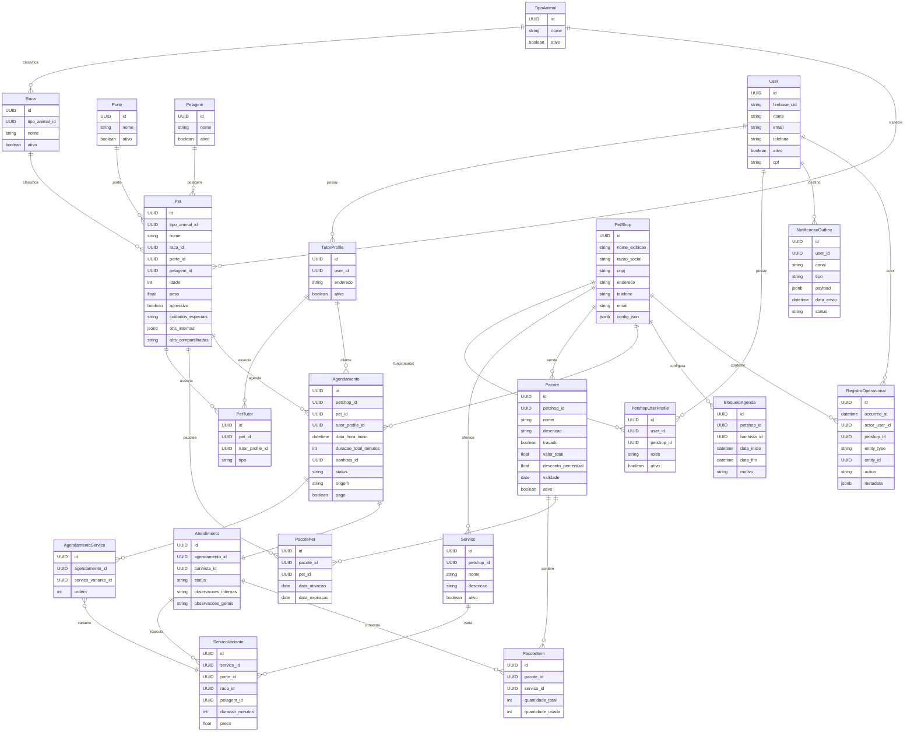
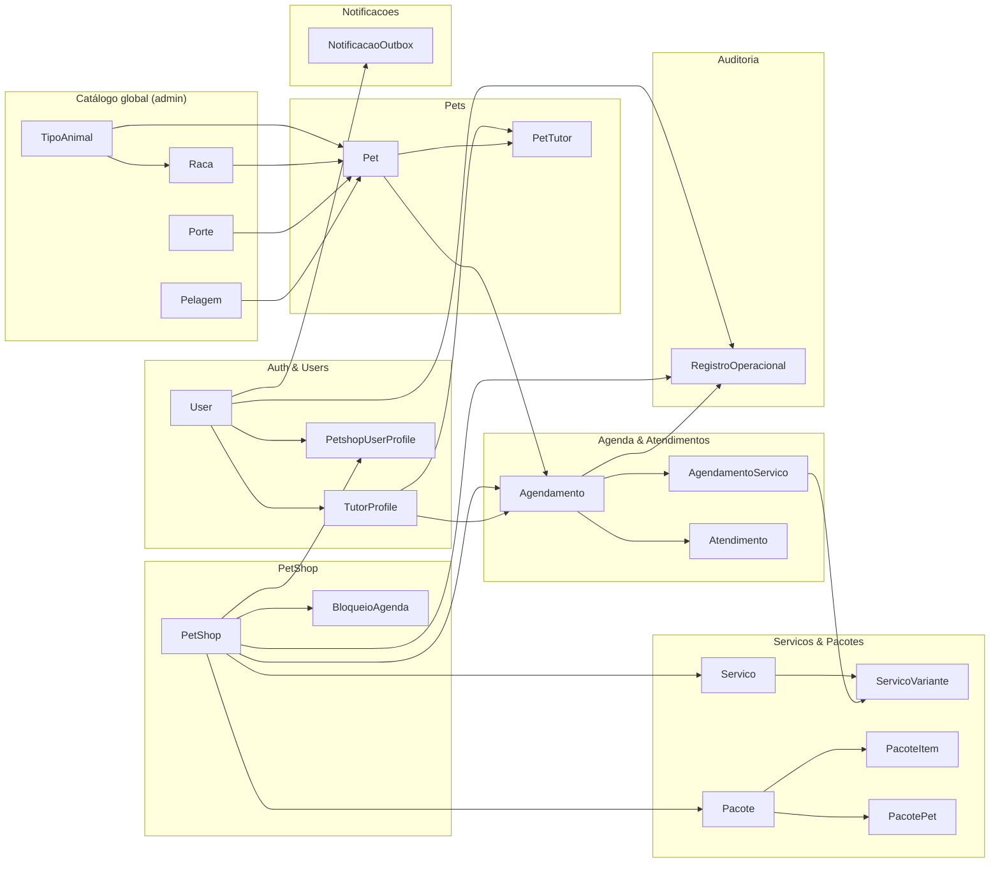

# Modelo de Domínio — Patafy Care

**Patafy** é o hub de aplicações; **Patafy Care** é o módulo de agendamento de banhos e cuidados para pet shops (escopo deste documento). Os *bounded contexts* abaixo pertencem ao backend do **Patafy Care**.

## 1. Bounded Contexts (módulos do backend)

Organização sugerida para o monólito:

### 1.1. Auth & Users

- Tutor (`TutorProfile`)
- Owner / Atendente / Banhista (`PetshopUserProfile`)
- Administrador do sistema
- Perfis e permissões
- Firebase Auth (e-mail/senha + **Google** no MVP)

### 1.2. Catálogo global (admin sistema)

- **TipoAnimal**, **Raca**, **Porte**, **Pelagem** — cadastro **universal**, compartilhado por todos os pet shops

### 1.3. Pets

- Pet, `PetTutor`, observações internas / compartilhadas
- **Tipo de animal obrigatório** no cadastro do pet; raça vinculada a um tipo no catálogo global

### 1.4. PetShop

- PetShop, configurações (`config_json`), funcionários, horários, bloqueios de agenda

### 1.5. Serviços & Pacotes

- Serviço, variações, pacotes e créditos
- **Dependência entre serviços** (ex.: hidratação exige banho no mesmo atendimento): **nice to have** (ver secção 7)

### 1.6. Agenda & Atendimentos

- Agendamento, `AgendamentoServico`, Atendimento, regras de slot e banhista
- Campo **`pago`** (indicador local; **sem** pagamento processado na plataforma)

### 1.7. Notificações

- **MVP:** e-mail transacional (eventos do PRD)
- **Nice to have:** push (FCM)

### 1.8. Auditoria

- `RegistroOperacional` — histórico append-only de ações relevantes

---

## 2. Tutor, pet shop e relação entre eles

- **Não existe** entidade nem FK **TutorProfile ↔ PetShop**.
- O tutor é cadastro **global** no sistema; pode ter **agendamentos** em **vários** pet shops ao longo do tempo.
- O pet shop **localiza** qualquer tutor já cadastrado (ex.: busca por **CPF** / e-mail) para vincular a um agendamento ou cadastro assistido de pet.
- A relação “tutor neste pet shop” aparece apenas de forma **derivada**: por **agendamentos** / **atendimentos** que referenciam `petshop_id` e um pet cujo tutor é o `TutorProfile` (via `PetTutor` e, no agendamento, `tutor_profile_id` quando necessário).

---

## 3. Entidades principais (PostgreSQL)

### 3.1. User

Identidade de autenticação (Firebase).

```
User
---------
id (UUID)
firebase_uid
nome
email
telefone
ativo
cpf
```

### 3.2. TutorProfile

Perfil B2C do tutor. **Sem** `petshop_id`.

```
TutorProfile
---------
id (UUID)
user_id (FK User)
endereco
ativo
```

### 3.3. PetshopUserProfile

Perfil B2B ligado a **um** pet shop.

```
PetshopUserProfile
---------
id (UUID)
user_id (FK User)
petshop_id (FK PetShop)
roles[] (enum: owner, atendente, banhista)
ativo
```

### 3.4. Catálogo global (somente administrador do sistema)

#### TipoAnimal

Ex.: cão, gato (extensível).

```
TipoAnimal
---------
id (UUID)
nome
ativo
ordem (int, opcional)
```

#### Raca

Cada raça pertence a **um** tipo de animal (`tipo_animal_id` **obrigatório**).

```
Raca
---------
id (UUID)
tipo_animal_id (FK TipoAnimal) NOT NULL
nome
ativo
ordem (int, opcional)
```

#### Porte

```
Porte
---------
id (UUID)
nome
ativo
ordem (int, opcional)
```

#### Pelagem

```
Pelagem
---------
id (UUID)
nome
ativo
ordem (int, opcional)
```

### 3.5. Pet

Todo pet deve ter **`tipo_animal_id`** obrigatório (além de raça, porte e pelagem do catálogo global).

```
Pet
---------
id (UUID)
tipo_animal_id (FK TipoAnimal) NOT NULL
nome
raca_id (FK Raca)
porte_id (FK Porte)
pelagem_id (FK Pelagem)
idade
peso
agressivo (bool)
cuidados_especiais (text)
obs_internas (jsonb por petshop)
obs_compartilhadas (text)
```

### 3.6. PetTutor (N:N)

```
PetTutor
---------
id (UUID)
pet_id (FK Pet)
tutor_profile_id (FK TutorProfile)
tipo (enum: responsavel, autorizado)
```

### 3.7. PetShop

```
PetShop
---------
id (UUID)
nome_exibicao
razao_social
cnpj
endereco
telefone
email
config_json (jsonb)
```

### 3.8. Servico

No **MVP**, dependências entre serviços **não** são obrigatórias na modelagem física; ver **secção 7**.

```
Servico
---------
id (UUID)
petshop_id (FK)
nome
descricao
ativo
```

### 3.9. ServicoVariante

```
ServicoVariante
---------
id (UUID)
servico_id (FK)
porte_id (FK Porte)
raca_id (FK Raca, opcional)
pelagem_id (FK Pelagem, opcional)
duracao_minutos
preco
```

### 3.10. Pacote

- **Travado:** composição fixa após a venda; preço fixo; variação por porte/pelagem nas variantes.
- **Personalizável:** montado na venda; desconto % opcional sobre o total.

```
Pacote
---------
id (UUID)
petshop_id
nome
descricao
travado (bool)
valor_total
desconto_percentual
validade
ativo
```

### 3.11. PacoteItem

`quantidade_usada` incrementa no débito ao entrar em **Em andamento** (idempotente).

```
PacoteItem
---------
id (UUID)
pacote_id
servico_id
quantidade_total
quantidade_usada
```

### 3.12. PacotePet

```
PacotePet
---------
id (UUID)
pacote_id
pet_id
data_ativacao
data_expiracao
```

### 3.13. Agendamento

Serviços e duração total fixados na marcação (`AgendamentoServico`).  
`tutor_profile_id` identifica **qual** tutor é o cliente daquele agendamento (quem agendou ou a quem o atendimento se refere), **sem** vínculo cadastral com o pet shop.

```
Agendamento
---------
id (UUID)
petshop_id (FK PetShop)
pet_id (FK Pet)
tutor_profile_id (FK TutorProfile)
data_hora_inicio
duracao_total_minutos
banhista_id (opcional, FK PetshopUserProfile)
status (enum — ver 3.15)
origem (tutor | atendente)
pago (boolean)   -- indicador local; pagamento fora da plataforma
```

### 3.14. AgendamentoServico (snapshot na marcação)

```
AgendamentoServico
---------
id (UUID)
agendamento_id (FK)
servico_variante_id (FK ServicoVariante)
ordem
```

### 3.15. Atendimento

```
Atendimento
---------
id (UUID)
agendamento_id (FK)
banhista_id (FK PetshopUserProfile)
status (enum)
observacoes_internas
observacoes_gerais
```

**Estados canônicos (Agendamento / Atendimento):** `Aguardando confirmacao` → `Confirmado` → (`Em andamento` | `Atrasado` | `Pronto`) → `Finalizado`; `Cancelado` conforme regras.

**Débito de pacote:** ao entrar em **Em andamento**, debitar créditos aplicáveis (idempotente).

> **Pagamento:** um único indicador **`pago` (boolean)** no **Agendamento** (acerto fora da plataforma). Não há processamento de pagamento na V1.

### 3.16. BloqueioAgenda

```
BloqueioAgenda
---------
id (UUID)
petshop_id
banhista_id (opcional)
data_inicio
data_fim
motivo
```

### 3.17. NotificacaoOutbox

```
NotificacaoOutbox
---------
id (UUID)
user_id (FK User)
canal (email | push)
tipo (agendado | confirmado | cancelado | alterado | ...)
payload (jsonb)
data_envio
status (pendente | enviado | falha)
```

### 3.18. RegistroOperacional (auditoria simples)

Tabela **append-only**: cada linha é um fato ocorrido no sistema. Leitura por pet shop (e global para admin).

```
RegistroOperacional
---------
id (UUID)
occurred_at (timestamptz)
actor_user_id (FK User, nullable se sistema)
petshop_id (FK PetShop, nullable para ações globais)
entity_type (text)   -- ex.: Agendamento, Atendimento, Pet, PacotePet
entity_id (UUID)
action (text)        -- ex.: CREATED, STATUS_CHANGED, FIELD_UPDATED, BANHISTA_CHANGED
metadata (jsonb)    -- snapshot opcional: antes/depois, IP, correlação com e-mail enviado, etc.
```

**Uso prático:** toda mudança relevante de status, remarcação, troca de banhista, marcação `pago`, etc. registra uma linha (via aplicação ou trigger leve — decisão na arquitetura).

---

## 4. Relacionamentos (alto nível)

- **1 User** → **0..1 TutorProfile** e **0..N PetshopUserProfile** (perfis distintos)
- **Não há** relação direta **TutorProfile ↔ PetShop**
- **1 TutorProfile → N PetTutor → N Pets**
- **1 PetShop → N funcionários** (`PetshopUserProfile`)
- **1 PetShop → N Servicos / Pacotes / Agendamentos**
- **TipoAnimal / Raca / Porte / Pelagem** → referenciados por **Pet** (`tipo_animal_id` **obrigatório**; `raca` também exige tipo) e (parcialmente) por **ServicoVariante**
- **1 Agendamento** → **1 Pet** + **1 PetShop** + **1 TutorProfile** (cliente do agendamento) + **N AgendamentoServico**
- **1 Agendamento → 1 Atendimento**
- **1 Atendimento** → serviços executados (variantes; baseline + adicionais no balcão)
- **1 Atendimento** → débito em **PacoteItem** quando aplicável
- **User** → **RegistroOperacional** como `actor_user_id`; entidades alvo em `entity_type` / `entity_id`

---

## 5. Regras de negócio incorporadas ao domínio

### Agenda

- **1 banhista = 1 atendimento por slot**; vários banhistas ⇒ paralelismo
- Sem overbooking no mesmo banhista; sem fila de espera

### Pacotes

- Créditos; débito em **Em andamento**; validade opcional; travado vs personalizável

### Serviços

- Variantes por porte/raça/pelagem; snapshot no agendamento
- **Dependência no mesmo atendimento** (ex.: hidratação exige banho): **nice to have** — ver secção 7

### Notificações

- MVP: e-mail nos quatro eventos; push opcional

### Pagamento

- Somente flag **`pago`**; acerto financeiro **fora** da plataforma

---

## 6. Arquitetura lógica de módulos (back-end)

Stack definida em **`docs/Arquitetura.md`**: **Fastify** + **GraphQL Yoga** + **Prisma** + PostgreSQL.

Módulos lógicos (pastas / *resolvers* por domínio — **não** são rotas REST):

```
auth / users
catalogo-global
petshops
pets
servicos
pacotes
agendamentos
atendimentos
notificacoes
auditoria
```

Cada módulo (padrão sugerido): **resolvers** GraphQL (Yoga), serviços de domínio, **Prisma Client**, *input types* / validação (ex.: Zod), regras de domínio.

---

## 7. Nice to have e decisões adiadas

| Item | Descrição |
| --- | --- |
| **Dependência entre serviços** | Regra do tipo: “não executar serviço B sem serviço A no **mesmo** atendimento”. Pode evoluir para tabela `ServicoDependencia(servico_id, exige_servico_id)` + validação na confirmação do agendamento / no atendimento. |
| **Push (FCM)** | Mesmos eventos do e-mail, quando priorizado. |

---

## 8. Diagrama ER (Mermaid)



---

## 9. Diagrama de Bounded Contexts (Mermaid)



**Nota:** não há aresta **TutorProfile → PetShop**; o fluxo passa por **Agendamento** (`petshop_id` + `tutor_profile_id`).
