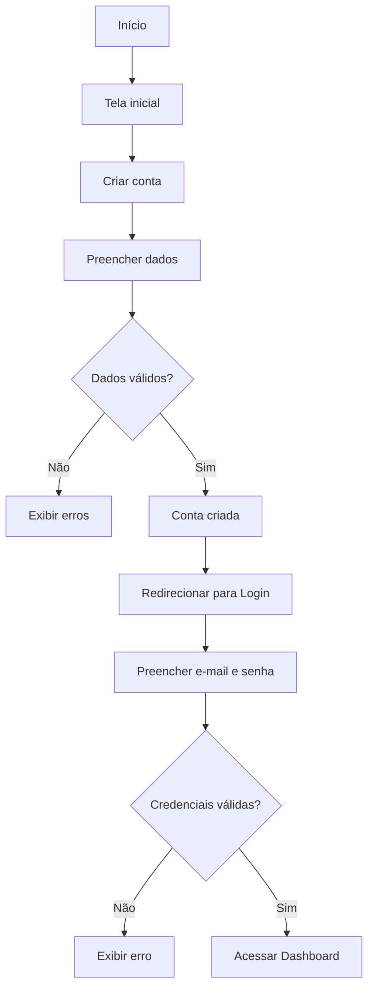
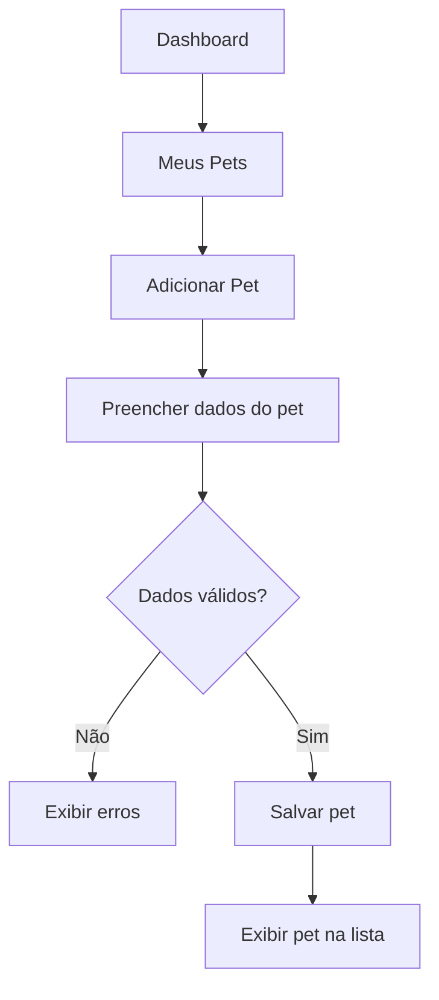
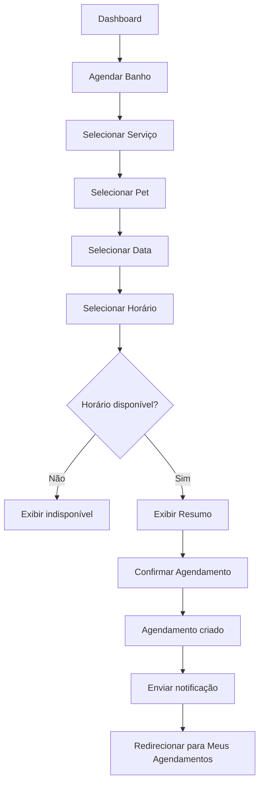
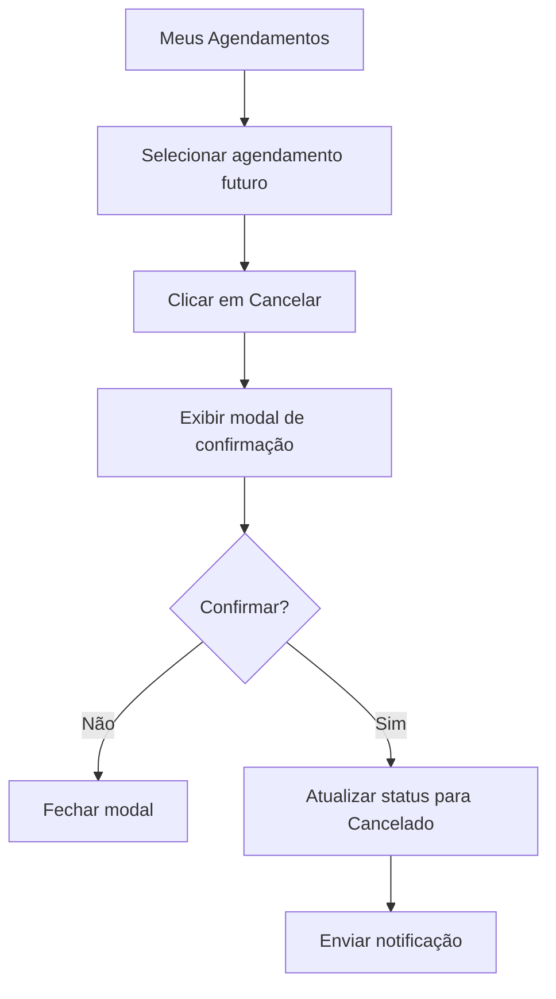
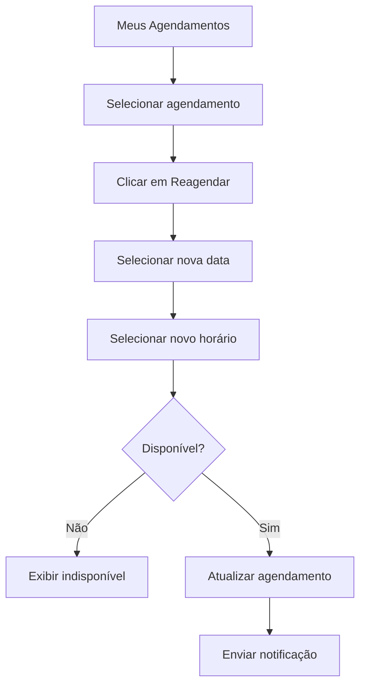
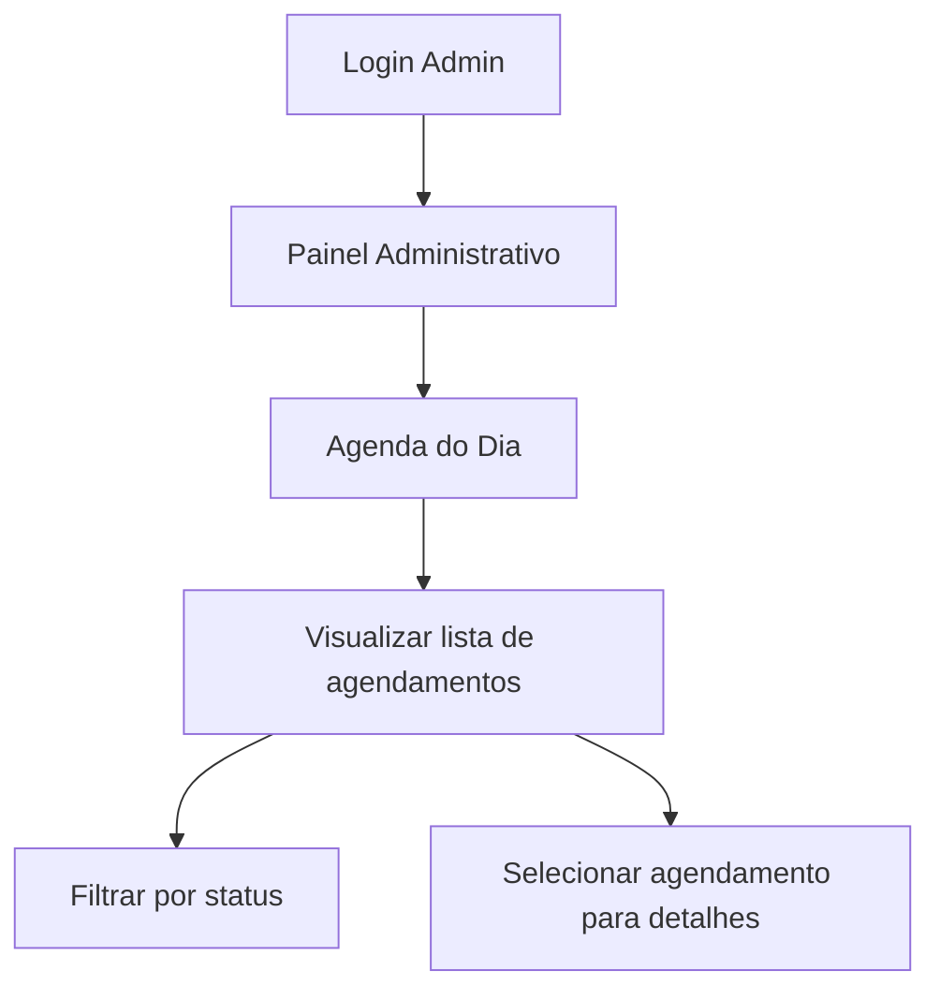
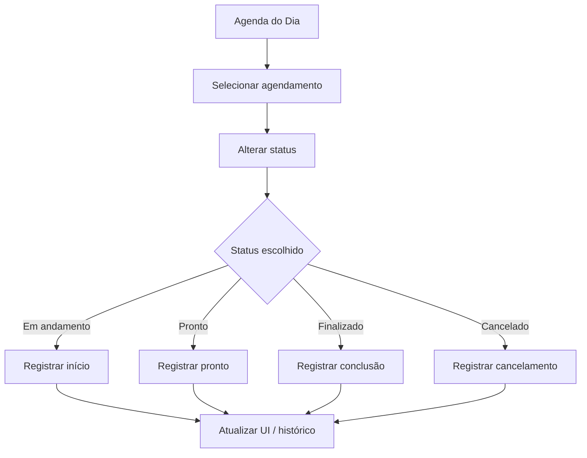
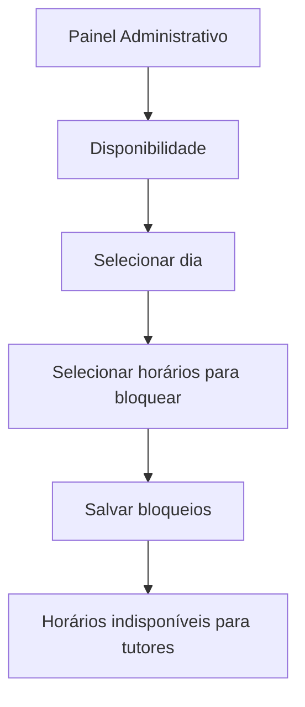
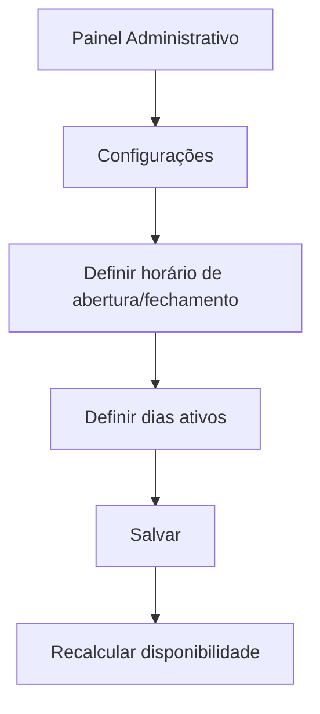

# PRD — Patafy Care

| **Visão geral do produto** | |
| --- | --- |
| **Hub** | **Patafy** — hub de aplicações (no MVP, apenas o módulo de banho/cuidados) |
| **Módulo** | **Patafy Care** — agendamento de serviços para pet shops |
| **Data prevista** |  |
| **Status do documento** | RASCUNHO |
| :running\_shirt\_with\_sash: **Membros da equipe** |  |
| **Links rápidos** | |
| **Designs** |  |
| :video\_camera: **Demonstração do Loom** |  |
| :card\_box: **Rastreador de tickets** |  |

## **1. Visão Geral do Produto**

### **1.0. Nomenclatura**

| Nome | Papel |
| --- | --- |
| **Patafy** | Hub de aplicações da marca. Agrupa módulos voltados a pet shops e tutores. **Neste repositório e no MVP**, o hub expõe somente o módulo de banho/cuidados. |
| **Patafy Care** | Módulo de **agendamento de serviços para pet shops** (banho, tosa, pacotes, agenda, notificações). É o escopo deste PRD e da implementação atual. |

Nas interfaces e comunicações com o usuário, preferir **Patafy** como marca do hub e **Patafy Care** quando for necessário distinguir o módulo (ex.: “Agende pelo Patafy Care”).

---

O **Patafy Care** é o módulo de agendamento de serviços para pet shops dentro do hub **Patafy**, permitindo que tutores agendem serviços diretamente pelo aplicativo, sem contato manual com o pet shop.  
O pet shop terá uma interface administrativa para gerenciar agenda, produtos, serviços, pacotes, status dos banhos e notificações.

---

## **2. Usuários do Sistema (Roles do Produto)**

### **2.1. Administrador (Owner do Pet Shop)**

- Acesso total ao sistema
- Configura serviços (banho, tosa, hidratação, etc.)
- Define preços
- Vê relatórios financeiros
- Gerencia equipe

---

### **2.2. Atendente / Recepção**

- Agenda banhos
- Cadastra clientes e pets
- Consulta histórico
- Atualiza status do banho conforme o fluxo canônico (ver premissas)
- Marca o indicador **pago / não pago** no agendamento (acerto fora da plataforma; ver modelo de domínio)
- Adiciona observações internas e externas (ex: “pet agitado”, “problema de pele”)

---

### **2.3. Banhista / Tosador**

- Visualiza agenda do dia
- Atualiza status do banho
- Adiciona observações internas e externas (ex: “pet agitado”, “problema de pele”)

---

### **2.4. Cliente (Tutor do Pet)**

- Agenda banho
- Visualiza histórico do pet
- Recebe **e-mails** nos eventos de agendamento do MVP (ver RF10); push como evolução
- Indicador **pago / não pago** no agendamento (evolutivo: detalhar pacote créditos na UI)
- Pode avaliar serviço (Ponto evolutivo)

### **2.5. Sistema / Automação**

- Dispara **e-mails transacionais** do MVP (eventos do RF10)
- Push quando implementado (*nice to have*)

### **2.6. Administrador do sistema**

- Cadastrar petshops
- Cadastrar Owners

---

## **3. Objetivos do Produto**

1. Permitir que tutores agendem atendimentos sem contato humano.
2. Oferecer ao pet shop uma visão clara da agenda, dos serviços e financeiro.
3. Enviar **notificações transacionais por e-mail** nos eventos do MVP (sem obrigatoriedade de lembretes automáticos antes do horário).
4. Reduzir erros de agendamento e retrabalho.
5. Criar um sistema simples, rápido e intuitivo.

---

## **4. Funcionalidades Principais (MVP)**

### **4.1 Cadastro e Login**

- Login por e-mail, telefone e **login social com Google** (MVP).
- Cadastro de tutor. (usuario pode se auto cadastrar e cadastro pelo atendente)
- Cadastro de pet (nome, raça, tamanho, idade, peso, pelagem e observações).

  - **Tipo de animal** (obrigatório no pet), raça, porte e pelagem vêm do **catálogo global** (administrador do sistema); o pet shop apenas **filtra** o que aceita nas configurações.
- Cadastro de pet shop.
- Cadastro de owner.

### **4.2 Catálogo de Serviços**

- Banho simples (por tamanho).
- Adicionais: hidratação, corte de unha, desembolo, etc.
- Associação de adicionais com serviço obrigatório
- Pacotes de banho (XX banhos + adicionais).
- Preços variáveis por porte.

### **4.3 Agenda do Tutor**

- Visualização de horários disponíveis.
- Seleção de pet(s).
- Seleção de serviços.
- Confirmação do agendamento.
- Histórico de banhos.
- Se precisar de transporte.
- O tutor pode adicionar o evento do calendário no seu calendário pessoal, baixando o evento direto da interface.

### **4.4 Agenda do Pet Shop**

- Calendário diário/semanal/mensal.
- Filtros por status do atendimento/agendamento:

  - Aguardando confirmação
  - Confirmado
  - Cancelado
  - Em andamento
  - Atrasado
  - Pronto
  - Finalizado
- Filtros por indicador de pagamento no agendamento:

  - Pago
  - Não pago
- Edição de horários e bloqueios.
- Adicionar observações do pet não visível ao tutor

### **4.5 Notificações (MVP)**

- **Canal no MVP:** **e-mail** para os eventos abaixo.
- **Nice to have (não bloqueia MVP):** notificações **push** (ex.: Firebase Cloud Messaging).
- **E-mails do MVP (tutor e demais destinatários definidos na arquitetura):**
  1. Banho **agendado** (solicitação criada; pode coincidir com “aguardando confirmação”).
  2. Banho **confirmado** pelo pet shop.
  3. Banho **cancelado**.
  4. Banho **alterado** (data/hora ou dados relevantes do agendamento).
- **Fora do MVP:** lembrete antes do banho, notificação “pet pronto”, recorrência / lembretes inteligentes (ver seção *Fora de escopo*).

### **4.6 Gestão de Pacotes, Banhos e Serviços**

- Os pagamentos não são realizados na plataforma; existe apenas um **campo booleano `pago`** no agendamento para controle operacional local.
- CRUD de serviços.

  - Ler, Criar, Editar, Deletar Serviços
  - Categorizar serviços
  - Adicionar variantes personalizáveis
  - Cada serviço terá um tempo de duração que deve ser usado para contabilizar o tempo de atendimento.
  - Poder adicionar variantes padrões: Raça, Tamanho, Pelagem
  - **Nice to have:** dependência entre serviços no **mesmo** atendimento (ex.: hidratação exige banho), com configuração opcional no catálogo quando implementado; no MVP pode ser só regra operacional do pet shop.
  - Os serviços devem estar disponíveis de acordo com o tamanho do pet selecionado. Exemplo: um cachorro cadastrado como grande, deve ter os serviços já filtrados pelo mesmo tamanho e raça do animal.
  - Deve ser possível contabilizar (quantidade por variação e preços) os serviços realizados com seus valores em um intervalo de tempo determinado. (relatórios)
  - Cada variação de serviço deve permitir um valor diferente
- CRUD de atendimentos (banhos).

  - Ler, Criar, Editar, atendimentos
  - **No agendamento** já ficam fixados os **serviços**, **variantes** e a **duração total** do slot; o **atendente** pode **adicionar novos serviços** durante o atendimento (com impacto em duração/preço conforme regras do pet shop).
  - Associar 1 atendimento a N serviços e N itens do pacote.
  - Associar 1 atendimento a 1 pet.
  - Status do atendimento e **indicador `pago` no agendamento** (sem processamento de pagamento na plataforma)
  - Associar os serviços do atendimento ao pacote
  - Associar 1 atendimento a 1 banhista no horário determinado
  - Deve ser possível contabilizar os atendimentos e serviços associados realizados com seus valores em um intervalo de tempo determinado. (relatórios)
  - Cada atendimento deve ter um campo de observações internas (não visíveis ao tutor e visível ao petshop) e observações gerais (visível somente ao tutor e ao petshop)
- CRUD de pacotes

  - Ler, Criar, Editar, Deletar pacotes de serviços.
  - Associar 1 pacote a N serviços.
  - Associar N pacotes a N pets.
  - **Pacote travado:** quantidade e tipos de serviços **pré-definidos** na composição do pacote (sem alteração depois da venda), **preço fixo**, podendo variar apenas conforme **porte** ou **pelagem** do pet (conforme regras de precificação definidas no catálogo).
  - **Pacote personalizável:** na venda, o atendente monta o pacote adicionando **diversos serviços e quantidades**; o preço é calculado a partir dos itens escolhidos e pode aplicar (ou não) **percentual de desconto** sobre o total.
  - Deve ser possível contabilizar os itens e serviços associados realizados com seus valores em um intervalo de tempo determinado. (relatórios)
  - Cada quantidade de serviço do pacote é 1 item. Exemplo: pacote de 10 banhos, são 10 itens do serviço banho.
  - Os pacotes funcionam como **créditos**. O **débito** dos itens do pacote ocorre quando o agendamento/atendimento muda o status para **Em andamento** (não no momento apenas do agendamento).
  - O Tutor deve poder consultar os pacote associados por pet, e o que ja foi "gasto” de cada pacote, e o que falta ainda gastar.
  - 1 pacote pode ter ou não validade para usar. Caso atinja a data de validade quando houver, ele não poderá ser mais “gasto".
  - Os pacote podem ser recorrente (Ponto evolutivo)
  - Os pacotes podem ter um valor especifico, ou terem uma % de desconto no valor final da somatória dos itens.

---

## **5. Requisitos Funcionais (RF)**

1. **RF01 - Cadastro de tutor**

   1. O sistema deve permitir que o tutor crie uma conta com dados básicos.

      1. Nome, endereço, cpf (primary key), telefone, email.
   2. O sistema deve permitir que o Atendente também possa criar uma conta para o tutor.

      1. o Atendente não vai cadastrar senha, duas opções viáveis:

         1. O Atendente dispara um link de definição de senha no whats do tutor;
   3. A autenticação deve ser criada junto. Podendo ser uma senha temporária, senha de acesso único, ou a senha definitiva (a ser definido com o método de autenticação)
   4. **Não** existe cadastro de vínculo **tutor ↔ pet shop**. O tutor é uma identidade **global**; a relação com um pet shop surge apenas por **agendamentos** (histórico em vários pet shops).
   5. 1 tutor pode ser associado a N pets
   6. Qualquer pet shop com permissão pode **localizar** um tutor já cadastrado no sistema (ex.: por **CPF** ou e-mail) para agendar ou cadastrar pet em nome dele — **sem** criar vínculo permanente tutor–loja.
2. **RF02 - Cadastro de Pets**

   1. O tutor pode cadastrar múltiplos pets com atributos específicos.

      1. Nome, **tipo de animal (obrigatório)**, raça, idade, pelagem (cor e tamanho), peso médio, é agressivo, precisa de cuidados especiais, observações médicas.
   2. O atendente pode cadastrar o pet para o tutor.
   3. Um tutor pode ter vários pets. Limite de 30 por tutor.
   4. Um pet pode ter vários tutores:

      1. o Tutor principal teria a opção de adicionar o compartilhamento do pet com outro tutor;
      2. o segundo Tutor teria que realizar o cadastro na aplicação, e após esse cadastro o Tutor principal, dentro do seu cadastro, acionar a opção de compartilhar o Pet.
   5. Cada pet deve ter um campo de observações internas (somente o petshop responsável pela observação pode ver a própria observação. não permitir visualizar de outros petshops) e observações compartilhadas com o tutor (o tutor ve as observações de todos os petshops, mas o petshop só ve o próprio).
3. **RF03 - Cadastro de pet shop**

   1. Os administradores do sistema devem cadastrar as empresas de petshop para poder operar o sistema.

      1. Nome a ser exibido, razão social, CNPJ (primary key), endereço, telefone, email, contato financeiro, contato responsável.
   2. Os administradores do sistema devem cadastrar 1 owner por pet shop.

      1. Nome, cpf (?), email, telefone. A autenticação deve funcionar conforme os outros usuários.
   3. O Owner deve cadastrar os atendentes e banhistas

      1. Nome, cpf (?), email, telefone. A autenticação deve funcionar conforme os outros usuários.
   4. O Owner é responsável pela configuração do sistema

      1. **Quais raças / tipos de animal o pet shop aceita** (filtro sobre o catálogo global administrado pelo sistema), e demais regras de aceite
      2. Se aceita todos os tipos de tamanho e pelagem
      3. Se aceita pets marcados como agressivos
      4. dados atualizados como telefone de contato e endereço
      5. tempo de intervalo entre banhos
      6. horário de funcionamento
      7. tempo limite de remarcação e cancelamento
      8. politica de cancelamento
      9. e demais futuras configurações e personalizações gerais do sistema
   5. O Owner deve cadastrar os serviços e pacotes
4. **RF04 - Cadastro de administrador do sistema e catálogo global**

   1. Os administradores do sistema mantêm o **catálogo universal** compartilhado por todos os pet shops: **tipo de animal**, **raça**, **porte** e **pelagem** (CRUD e ativação/inativação).
   2. Um administrador do sistema deve cadastrar outro administrador.

      1. Nome, email (PK?)
      2. Deve estar preparado para futuras roles internas
5. **RF05 - Regras gerais de usuários**

   1. Tutores são únicos no sistema por **CPF** (e e-mail); o mesmo tutor pode ter agendamentos em **vários** pet shops ao longo do tempo, **sem** registro de “associação” tutor–pet shop além dos próprios agendamentos.
   2. O cadastro por usuários de petshop do sistema (owner, atendente, banhista) são vinculados ao email e CPF. Porém serão separados.
   3. Um usuário pode ter mais de uma role acumulada. Por exemplo o Owner pode ter tanto os privilégios de atendente e banhista, para casos onde o petshop é uma única pessoa.

      1. Roles que podem ser acumuladas:  
         Owner  
         Atendente  
         Banhista
6. **RF06 - Catálogo de Serviços**

   1. O sistema deve permitir que o Owner crie e edite os serviços.
   2. Cada serviço deve permitir adicionar variantes com preços únicos por variante.

      1. Variante automática por tamanho (mini, pequeno, médio, grande, extra grande)
   3. O sistema deve permitir criar pacotes de serviços e realizar o controle deles por pet.
   4. Os serviços devem ter um tempo configurável para o bloqueio na agenda. Deve ser variável de acordo com a variante, e serviços adicionar deve adicionar ou não mais tempo.

      1. Aqui estamos falando sobre o tempo que vai levar o serviço.
   5. **Pacotes — tipos**
      1. **Pacote travado:** serviços e quantidades fixos na definição do pacote; preço fixo; variação permitida apenas por **porte** e/ou **pelagem** na precificação.
      2. **Pacote personalizável:** na venda, o atendente define serviços e quantidades; preço calculado pela soma dos itens, com **desconto percentual opcional** sobre o total.
   6. **Pacotes — débito de créditos:** o sistema deve **debitar** itens do pacote quando o status do agendamento/atendimento passar para **Em andamento** (transição única por atendimento, idempotente na implementação).
7. **RF07 - Agendamento**

   1. O tutor deve conseguir selecionar o pet shop, data, horário, pet, banhista (se disponível) e serviços disponíveis para o pet. O sistema deve **persistir o tutor** (`tutor_profile` do contexto), as **variantes escolhidas** e a **duração total** usada para ocupar o slot na agenda. (Lembrar do controle de pacote quando aplicável.)
   2. Cada banhista só pode realizar **1 atendimento por slot de tempo** (sem sobreposição para o mesmo banhista).
   3. O pet shop pode ter **vários banhistas**; em um mesmo instante a capacidade é a **soma dos slots** (um fluxo paralelo por banhista).
   4. o atendimento que não é especificado o banhista no momento do agendamento, entra para o primeiro banhista do petshop com horário vago, podendo ser alterado depois.
   5. Assim que um agendamento é realizado pelo tutor, o atendente do petshop deve confirmar o agendamento
   6. Se o agendamento é realizado pelo atendente, automaticamente ele já é confirmado.
   7. O tutor pode escolher especificamente um banhista no momento do agendamento. Caso ele escolha, o atendente do petshop não pode trocar o banhista. Só pode alterar data e horário.
8. **RF08 - Controle de Agenda do Pet Shop**

   1. O atendente do pet shop deve visualizar e editar agendamentos.
   2. O atendente do pet shop deve poder alternar o serviço entre o banhista responsável caso não especificado pelo tutor.
   3. O atendente do pet shop pode bloquear horários da agenda do banhista deixando indisponível para marcar atendimentos manualmente.

      1. quando for bloquear uma agenda que ja tem banho marcado, o tutor é notificado da mudança de data e horário.
      2. Quando houve alteração somente de banhista não especificado, não notificar o tutor, fica só no histórico quem realizou o banho.
      3. não permitir alteração de banhista caso foi especificado. somente de data e hora.
   4. O atendente pode **adicionar serviços** durante o atendimento (além dos já fixados no agendamento), até o encerramento do atendimento, conforme regras do pet shop.
   5. Um banho pode ser cancelado automaticamente se houver atraso de X hora.

      1. Dele colocar a opção de não compareceu.

         1. Tanto para o Tutor quanto para o Pet shop, irá refletir esse status;
         2. Indicador **`pago`** no agendamento: em cancelamento ou “não compareceu”, permanece **não pago** por padrão (ajustes finos na arquitetura, sem gateway de pagamento).
9. **RF09 - Atualização de Status**

   1. O atendente ou banhista pode mudar o status do atendimento/agendamento, respeitando as transições definidas na arquitetura.

      1. **Estados canônicos:** Aguardando confirmação, Confirmado, Cancelado, Em andamento, Atrasado, Pronto, Finalizado.
   2. No **MVP**, o tutor **não** recebe e-mail a cada mudança de status; comunicações transacionais seguem o **RF10** (eventos de agendamento). Mudanças de status podem refletir na UI e no histórico interno.
10. **RF10 - Notificações (MVP)**

    1. O sistema deve enviar **e-mail** nos seguintes eventos: **banho agendado**, **banho confirmado**, **banho cancelado**, **banho alterado** (ex.: remarcação ou mudança relevante cadastrada pelo pet shop).
    2. **Push** (ex.: FCM) é **nice to have** e pode ficar fora do escopo mínimo de entrega do MVP.
11. **~~RF11 - Recorrência (futuro)~~**

    1. ~~O sistema deve sugerir novos banhos com base no histórico~~

---

## **6. Requisitos Não Funcionais (RNF)**

### **RNF01 — Usabilidade**

Interface simples, intuitiva e mobile-first. Com PWA para tornar instalável.

### **RNF02 — Performance**

Carregamento de telas em até 3 segundos. Web Core Vitals no verde.

### **RNF03 — Segurança e rastreabilidade**

- Criptografia de dados sensíveis.
- Autenticação segura.
- **Auditoria operacional:** registro **append-only** de ações relevantes (quem, quando, entidade, tipo de ação, metadados), conforme `RegistroOperacional` no modelo de domínio.

### **RNF04 — Escalabilidade e multi-tenant**

Cada **pet shop** opera de forma **independente** (dados, agenda, catálogo e configurações isolados). Não há, neste produto, **gerenciamento de franquias** nem compartilhamento de agenda entre unidades de uma rede.

---

## **7. Fora de escopo**

- Pagamentos pela plataforma
- Notificações de **recorrência** (atendimentos e pacotes)
- **Lembrete** automático antes do horário do banho
- Notificações **push** como requisito obrigatório do MVP (apenas *nice to have*; ver RF10)
- Avaliação do atendimento pelo tutor
- Notificações por SMS ou WhatsApp

---

## **8. Premissas**

#### **1. Premissas sobre o Pet Shop**

- O pet shop tem **horário de funcionamento fixo** e conhecido e cadastrado por ele.
- Existe **1 atendimento por banhista por slot**; o pet shop pode ter **vários banhistas** (capacidade paralela = quantidade de banhistas com agenda livre).
- O pet shop **define seus próprios serviços**, podendo ele cadastrar conforme sua necessidade, podendo incluir: banho simples, banho completo, tosa, tosa higiênica, corte de unha, enfeite, tintura, gromming, desembolo, hidratação, progressiva, spa, cromoterapia e etc. Cada um com sua variação, limitação, preço e duração.
- O pet shop **não exige pagamento online** na primeira versão. Isso deve ser acertado manualmente com o pet shop
- O pet shop **tem acesso a um painel administrativo**.
- O pet shop terá dentro do sistema um json de definições personalizáveis para diversos itens, como tamanhos de animais que atende, raça que aceita, horário de funcionamento padrão, tempo de cancelamento, logo, nome e etc.

#### **2. Premissas sobre o Tutor**

- O tutor terá um login e pagina de cadastro próprio.
- O tutor pode cadastrar **vários pets**.
- O tutor pode ou **não escolher funcionário**, apenas horário.
- O tutor recebe **e-mail** nos eventos de agendamento definidos no **RF10** (MVP). **Push** é opcional (*nice to have*).
- O tutor pode cancelar até X horas antes configurada pelo owner nas definições do petshop.

#### **3. Premissas sobre o Produto**

- O **hub Patafy** no MVP contém apenas o módulo **Patafy Care**; outros módulos do hub ficam fora deste escopo.
- A primeira versão é **web** ou mobile-first com PWA.
- Não haverá **integração com pagamento** na V1; apenas **indicador `pago`** no agendamento.
- **Catálogo universal** de **tipo de animal**, **raça**, **porte** e **pelagem**, mantido pelo **administrador do sistema**, compartilhado por todos os pet shops.
- **Auditoria operacional simples** (registro append-only de ações relevantes: status, remarcação, troca de banhista, `pago`, etc.), conforme modelo de domínio.
- Não haverá **integração com WhatsApp** na V1.
- Haverá **export de evento de calendário (.ics) para o tutor poder importar em seu calendário pessoal**.
- O **back-end** será **monólito** (um serviço API: Fastify + GraphQL Yoga + Prisma); o **front** será **monorepo Nx** com **duas aplicações** separadas (`web-tutor`, `web-petshop`) — ver `docs/Arquitetura.md`.
- O sistema usará **autenticação disponível no Firebase**.

#### **4. Premissas sobre Serviços e Pacotes**

- Pacotes funcionam como **créditos pré-pagos**.
- Serviços têm **duração fixa** definida pelo pet shop.
- Serviços variam por tipo de animal / raça / porte / pelagem (referências ao catálogo global).

#### **5. Premissas sobre Regras de Agendamento**

- Cada serviço ocupa **tempo** na agenda; a **duração total** do agendamento é a soma das variantes escolhidas na marcação (serviços adicionados depois podem estender o atendimento conforme regra do pet shop).
- O sistema não faz **overbooking** no **mesmo banhista** no **mesmo intervalo**.
- O sistema não faz **fila de espera**.
- O tutor pode agendar **vários serviços por pet por vez em um único atendimento** (snapshot no agendamento).

#### **6. Estados canônicos do atendimento / agendamento**

Ordem lógica de referência (transições exatas ficam para o documento de arquitetura):

`Aguardando confirmação` → `Confirmado` → (`Em andamento` | `Atrasado` | `Pronto`) → `Finalizado`, com `Cancelado` conforme regras de negócio.

- **Aguardando confirmação:** criado pelo tutor (ou fluxo equivalente) e pendente de ação do pet shop.
- **Confirmado:** pet shop confirmou (ou criado já confirmado pelo atendente).
- **Cancelado:** agendamento não será realizado.
- **Em andamento:** banho em execução (**ponto de débito de pacote**, ver RF06).
- **Atrasado:** pet/atendimento fora do esperado (ex.: tolerância configurável).
- **Pronto:** pet pronto para retirada (comunicação “pet pronto” por e-mail fica fora do MVP mínimo, salvo decisão futura).
- **Finalizado:** atendimento concluído e encerrado administrativamente.

---

## **9. Visão técnica (stack)**

> **Hasura não** faz parte do escopo. A stack concreta do repositório está em **`docs/Arquitetura.md`** (ADRs).

| Camada | Tecnologia |
| --- | --- |
| **Monorepo** | **Nx** |
| **Front tutor** | React + Vite + [Park UI](https://park-ui.com/docs/figma) — app **`web-tutor`** (só tutor) |
| **Front pet shop** | React + Vite + Park UI — app **`web-petshop`** (só equipa da loja) |
| **Back-end** | **Node/TypeScript:** **Fastify** + **GraphQL Yoga** + **Prisma** |
| **Banco de dados** | PostgreSQL |
| **API (contrato)** | GraphQL (Yoga) — ver `docs/Arquitetura.md` |
| **Autenticação** | Firebase Authentication (inclui **Google** como provedor social no MVP) |
| **Infraestrutura** | Firebase (Auth) + hospedagem API e SPAs conforme decisão de deploy |
| **E-mail (MVP)** | Serviço de envio transacional a definir na arquitetura (ex.: SendGrid, SES, Resend) |
| **Push (*nice to have*)** | Firebase Cloud Messaging (quando priorizado) |

### **Nota para equipe majoritariamente front-end**

O monorepo **Nx** com **duas SPAs** (tutor vs pet shop) partilha tooling e opcionalmente pacotes (`ui`, cliente GraphQL gerado). O back em **TypeScript** (**Fastify**, **Yoga**, **Prisma**) mantém uma única linguagem com o front e contrato GraphQL com *codegen* para tipos seguros nas duas apps.

---

## **10. Critérios de Aceite (CA)**

### **10.1. Cadastro e gerenciamento de tutor e pets**

### **TUT-01 — Cadastro de tutor**

| **Campo** | **Conteúdo** |
| --- | --- |
| **História** | **Como tutor, quero criar uma conta para acessar o sistema** |
| **Importância** | **ALTA** |
| **Critérios de Aceite** | - **Given que estou na tela de cadastro When preencho todos os campos obrigatórios Then minha conta deve ser criada** - **Given que deixo campos obrigatórios vazios When envio o formulário Then devo ver mensagens de erro** - **Given que uso um e-mail já cadastrado When tento criar conta Then devo ver mensagem de e-mail duplicado** |
| **Item Jira** | **TUT-01** |
| **Notas** | **Autenticação própria** |

---

### **TUT-02 — Login do tutor**

| **Campo** | **Conteúdo** |
| --- | --- |
| **História** | **Como tutor, quero fazer login para acessar meus pets e agendamentos** |
| **Importância** | **ALTA** |
| **Critérios de Aceite** | - **Login com e-mail/senha ou Google deve permitir acesso** - **Credenciais inválidas devem exibir erro** - **Sessão deve permanecer ativa até logout** |
| **Item Jira** | **TUT-02** |
| **Notas** | **Firebase Auth; Google no MVP** |

---

### **PET-01 — Cadastro de pet**

| **Campo** | **Conteúdo** |
| --- | --- |
| **História** | **Como tutor, quero cadastrar meus pets** |
| **Importância** | **ALTA** |
| **Critérios de Aceite** | - **Cadastro deve exigir campos obrigatórios** (incluindo **tipo de animal**) - **Pet deve aparecer na lista após salvar** - **Campos inválidos devem exibir erro** |
| **Item Jira** | **PET-01** |
| **Notas** | **Nome, tipo de animal (obrigatório), raça, porte, idade, pelagem** |

---

### **PET-02 — Edição de pet**

| **Campo** | **Conteúdo** |
| --- | --- |
| **História** | **Como tutor, quero editar informações do meu pet** |
| **Importância** | **MÉDIA** |
| **Critérios de Aceite** | - **Alterações devem ser salvas e refletidas imediatamente** - **Campos obrigatórios devem ser validados** |
| **Item Jira** | **PET-02** |
| **Notas** | **—** |

---

### **PET-03 — Exclusão de pet**

| **Campo** | **Conteúdo** |
| --- | --- |
| **História** | **Como tutor, quero excluir um pet** |
| **Importância** | **BAIXA** |
| **Critérios de Aceite** | - **Exclusão deve pedir confirmação** - **Após excluir, pet não aparece mais na lista** - **Soft delete** |
| **Item Jira** | **PET-03** |
| **Notas** | **—** |

---

### **10.2. Catálogo de serviços e pacotes**

### **SRV-01 — Listagem de serviços**

| **Campo** | **Conteúdo** |
| --- | --- |
| **História** | **Como tutor, quero visualizar os serviços disponíveis** |
| **Importância** | **ALTA** |
| **Critérios de Aceite** | - **Exibir todos os serviços ativos** - **Exibir estado vazio se não houver serviços** |
| **Item Jira** | **SRV-01** |
| **Notas** | **—** |

---

### **SRV-02 — Detalhes do serviço**

| **Campo** | **Conteúdo** |
| --- | --- |
| **História** | **Como tutor, quero ver detalhes do serviço** |
| **Importância** | **MÉDIA** |
| **Critérios de Aceite** | - **Exibir descrição, duração e preço** - **Exibir botão para agendar** |
| **Item Jira** | **SRV-02** |
| **Notas** | **—** |

---

### **ADM-01 — Gerenciamento de serviços**

| **Campo** | **Conteúdo** |
| --- | --- |
| **História** | **Como pet shop, quero criar e editar serviços** |
| **Importância** | **ALTA** |
| **Critérios de Aceite** | - **Criar, editar e desativar serviços** - **Serviços desativados não aparecem para tutores** |
| **Item Jira** | **ADM-01** |
| **Notas** | **—** |

---

### **ADM-02 — Gerenciamento de pacotes**

| **Campo** | **Conteúdo** |
| --- | --- |
| **História** | **Como pet shop, quero criar pacotes** |
| **Importância** | **MÉDIA** |
| **Critérios de Aceite** | - **Criar pacotes com créditos** - **Associar pacotes a serviços** - **Pacotes inativos não aparecem** |
| **Item Jira** | **ADM-02** |
| **Notas** | **Pacotes = créditos (premissa)** |

---

### **10.3. Agendamento**

### **AGD-01 — Seleção de data e horário**

| **Campo** | **Conteúdo** |
| --- | --- |
| **História** | **Como tutor, quero escolher um horário disponível** |
| **Importância** | **ALTA** |
| **Critérios de Aceite** | - **Exibir apenas horários dentro do funcionamento** - **Exibir apenas horários com capacidade** - **Impedir horários passados** |
| **Item Jira** | **AGD-01** |
| **Notas** | **—** |

---

### **AGD-02 — Ver disponibilidade**

| **Campo** | **Conteúdo** |
| --- | --- |
| **História** | **Como tutor, quero ver horários disponíveis** |
| **Importância** | **ALTA** |
| **Critérios de Aceite** | - **Horários lotados devem aparecer indisponíveis** - **Horários livres devem ser clicáveis** |
| **Item Jira** | **AGD-02** |
| **Notas** | **—** |

---

### **AGD-03 — Confirmação de agendamento**

| **Campo** | **Conteúdo** |
| --- | --- |
| **História** | **Como tutor, quero confirmar o agendamento** |
| **Importância** | **ALTA** |
| **Critérios de Aceite** | - **Exibir resumo antes de confirmar** - **Criar agendamento sem pagamento online** - **Persistir serviços, variantes e duração total no agendamento** - **Enviar e-mail de “banho agendado” (e “confirmado” quando aplicável ao fluxo)** |
| **Item Jira** | **AGD-03** |
| **Notas** | **Alinhado ao RF07 / RF10** |

---

### **AGD-04 — Cancelamento**

| **Campo** | **Conteúdo** |
| --- | --- |
| **História** | **Como tutor, quero cancelar um agendamento** |
| **Importância** | **ALTA** |
| **Critérios de Aceite** | - **Permitir cancelamento até X horas antes** - **Exibir modal de confirmação** - **Atualizar status para cancelado** |
| **Item Jira** | **AGD-04** |
| **Notas** | **—** |

---

### **AGD-05 — Reagendamento**

| **Campo** | **Conteúdo** |
| --- | --- |
| **História** | **Como tutor, quero remarcar um horário** |
| **Importância** | **MÉDIA** |
| **Critérios de Aceite** | - **Permitir escolher novo horário** - **Validar disponibilidade** - **Registrar histórico** |
| **Item Jira** | **AGD-05** |
| **Notas** | **—** |

---

### **AGD-06 — Visualizar meus agendamentos**

| **Campo** | **Conteúdo** |
| --- | --- |
| **História** | **Como tutor, quero ver meus agendamentos** |
| **Importância** | **ALTA** |
| **Critérios de Aceite** | - **Exibir próximos e passados** - **Exibir status** - **Permitir cancelar ou remarcar** |
| **Item Jira** | **AGD-06** |
| **Notas** | **—** |

---

### **10.4. Painel administrativo**

### **ADM-03 — Visualizar agenda do dia**

| **Campo** | **Conteúdo** |
| --- | --- |
| **História** | **Como pet shop, quero ver os banhos do dia** |
| **Importância** | **ALTA** |
| **Critérios de Aceite** | - **Exibir lista do dia** - **Permitir filtrar por status** |
| **Item Jira** | **ADM-03** |
| **Notas** | **—** |

---

### **ADM-04 — Atualizar status do banho**

| **Campo** | **Conteúdo** |
| --- | --- |
| **História** | **Como pet shop, quero atualizar o status** |
| **Importância** | **ALTA** |
| **Critérios de Aceite** | - **Permitir marcar os estados canônicos** (Aguardando confirmação, Confirmado, Cancelado, Em andamento, Atrasado, Pronto, Finalizado) **conforme transições permitidas** - **Registrar horário da mudança** - **E-mails ao tutor apenas nos eventos do RF10 (MVP)** |
| **Item Jira** | **ADM-04** |
| **Notas** | **Ver premissas — estados canônicos — e RF09** |

---

### **ADM-05 — Bloquear horários**

| **Campo** | **Conteúdo** |
| --- | --- |
| **História** | **Como pet shop, quero bloquear horários** |
| **Importância** | **MÉDIA** |
| **Critérios de Aceite** | - **Bloquear horários específicos** - **Horários bloqueados não aparecem para tutores** |
| **Item Jira** | **ADM-05** |
| **Notas** | **—** |

---

### **ADM-06 — Gerenciar horários de funcionamento**

| **Campo** | **Conteúdo** |
| --- | --- |
| **História** | **Como pet shop, quero definir horários de funcionamento** |
| **Importância** | **ALTA** |
| **Critérios de Aceite** | - **Definir abertura/fechamento** - **Definir dias ativos** - **Impedir agendamentos fora do horário** |
| **Item Jira** | **ADM-06** |
| **Notas** | **—** |

---

### **ADM-07 — Equipe de banhistas e slots**

| **Campo** | **Conteúdo** |
| --- | --- |
| **História** | **Como pet shop, quero cadastrar banhistas para ter mais de um atendimento em paralelo** |
| **Importância** | **ALTA** |
| **Critérios de Aceite** | - **Cada banhista possui agenda própria** - **Em um mesmo horário, até N atendimentos simultâneos, sendo N = banhistas com slot livre** - **Não permitir dois atendimentos sobrepostos no mesmo banhista** |
| **Item Jira** | **ADM-07** |
| **Notas** | **1 banhista = 1 atendimento por slot; vários banhistas = paralelismo** |

---

### **10.5. Notificações (MVP — e-mail)**

### **NOT-01 — E-mails transacionais do MVP**

| **Campo** | **Conteúdo** |
| --- | --- |
| **História** | **Como tutor, quero receber e-mail quando meu agendamento mudar de estado relevante** |
| **Importância** | **ALTA** |
| **Critérios de Aceite** | - **Enviar e-mail em: banho agendado, banho confirmado, banho cancelado, banho alterado** - **Conteúdo deve incluir data, horário, pet shop, pet e serviços principais** - **Falha de envio deve ser tratada na arquitetura (retry/log)** |
| **Item Jira** | **NOT-01** |
| **Notas** | **Push = nice to have (RF10)** |

---

### **NOT-02 — Push (nice to have)**

| **Campo** | **Conteúdo** |
| --- | --- |
| **História** | **Como tutor, quero receber push para os mesmos eventos do NOT-01** |
| **Importância** | **BAIXA** |
| **Critérios de Aceite** | - **Quando implementado, espelhar eventos do NOT-01** - **Opt-in/opt-out conforme arquitetura** |
| **Item Jira** | **NOT-02** |
| **Notas** | **Fora do escopo mínimo do MVP** |

---

### **NOT-03 — Lembretes e pós-MVP**

| **Campo** | **Conteúdo** |
| --- | --- |
| **História** | **Como tutor, quero lembrete antes do banho e aviso “pet pronto”** |
| **Importância** | **MÉDIA (pós-MVP)** |
| **Critérios de Aceite** | - **Fora do MVP mínimo** (ver *Fora de escopo* e RF10) |
| **Item Jira** | **NOT-03** |
| **Notas** | **Roadmap futuro** |

---

### **10.6. Catálogo global e auditoria**

### **ADM-CAT-01 — CRUD do catálogo global (administrador do sistema)**

| **Campo** | **Conteúdo** |
| --- | --- |
| **História** | **Como administrador do sistema, quero manter o catálogo universal de tipo de animal, raça, porte e pelagem** |
| **Importância** | **ALTA** |
| **Critérios de Aceite** | - **CRUD** (criar, listar, editar, ativar/inativar) para **TipoAnimal**, **Raca**, **Porte** e **Pelagem** - **Raça exige `tipo_animal` obrigatório** (alinhado ao modelo de domínio) - **Itens inativos não aparecem** em selects de cadastro de pet/serviço para novos registros (comportamento de leitura conforme arquitetura) |
| **Item Jira** | **ADM-CAT-01** |
| **Notas** | **RF04; catálogo compartilhado por todos os pet shops** |

---

### **ADM-AUD-01 — Listagem de RegistroOperacional**

| **Campo** | **Conteúdo** |
| --- | --- |
| **História** | **Como pet shop (ou admin), quero ver o histórico operacional de um agendamento ou da minha unidade** |
| **Importância** | **MÉDIA** |
| **Critérios de Aceite** | - **Listar registros** ordenados do mais recente ao mais antigo - **Filtro por `petshop_id`** (usuário do pet shop vê apenas o seu contexto; admin conforme permissão) - **Filtro por agendamento** (`entity_type` + `entity_id` do agendamento, ou equivalente definido na arquitetura) - **Exibir** data/hora, ação, autor (quando houver) e resumo do `metadata` (ex.: mudança de status, `pago`, remarcação) |
| **Item Jira** | **ADM-AUD-01** |
| **Notas** | **`RegistroOperacional` no modelo de domínio; RNF03** |

---

## **11. Métricas de Sucesso**

- 70% de agendamentos feitos sem contato humano.
- Tempo médio de atendimento reduzido.
- Aumento de recorrência de banhos.
- Redução de erros de agenda.
- Satisfação dos tutores.

---

## **12. Roadmap (MVP → Evolução)**

### **MVP**

- Cadastro
- Pets
- Agenda
- Serviços
- Notificações por **e-mail** (eventos do RF10); push quando priorizado
- Status do banho

### **Pós-MVP**

- Pagamentos online
- Chat tutor ↔ pet shop
- Programa de fidelidade
- Dashboard de métricas
- PDV de produtos
- Controle de estoque
- Gerenciador de hotel Pet

---

## **13. Regras do Sistema (visão geral)**

- Regras de disponibilidade.
- Regras de recorrência.
- Regras de notificação.
- Regras de bloqueio de horários.
- Regras de cálculo de preço por porte.

---

## **14. Fluxos de UX**

Fluxo de cadastro e login (tutor)

Fluxo de Cadastro de Pet

Fluxo de agendamento (Tutor)

Fluxo de Cancelamento de Agendamento

Fluxo de Reagendamento

Fluxo do Painel Administrativo — Agenda do Dia

Fluxo de Atualização de status do banho (admin)

Fluxo de Bloqueio de Horários (Admin)

Fluxo de Configuração de Horário de Funcionamento (Admin)
