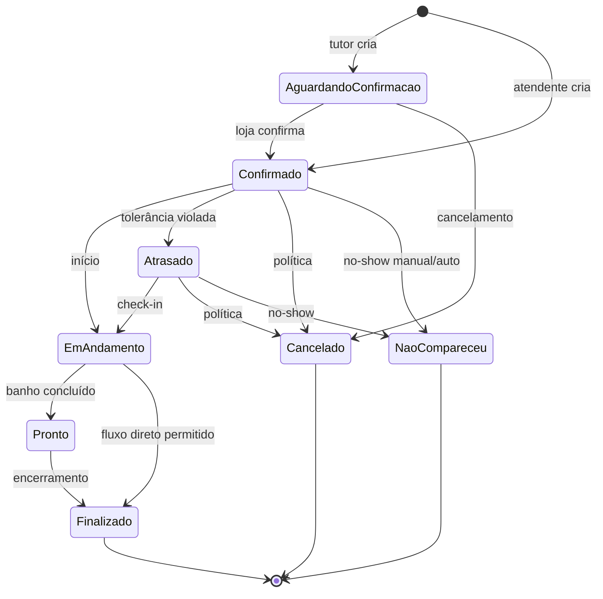

# E07 — Agendamentos e Ciclo de Vida

| Campo | Valor |
| --- | --- |
| **ID** | E07 |
| **Fase** | MVP |
| **Dependências** | E04, E05, E06 |
| **Apps** | `api`, `web-tutor`, `web-petshop` |
| **Rastreabilidade** | RF07, RF08, RF09; CA AGD-03 a AGD-06, ADM-03, ADM-04 |

## Objetivo

Fluxo completo de marcação, confirmação, remarcação, cancelamento, máquina de estados (incluindo **`NaoCompareceu`**), export `.ics` e gestão da agenda B2B.

## Decisão aplicável

- **`NaoCompareceu`** é status **separado** de `Cancelado` (decisão #10)
- Indicador `pago` permanece **não pago** por padrão em `Cancelado` e `NaoCompareceu`

## Entidades

`Agendamento`, `AgendamentoServico`, `Atendimento` (criação 1:1 na marcação)

## Máquina de estados (`Agendamento.status`)

### Serviço `AgendamentoStateMachine`

- Validar transições; rejeitar saltos inválidos com `INVALID_STATUS_TRANSITION`
- Registrar cada transição em `RegistroOperacional` (E10)

## Regras de negócio

### Criação

| Origem | Status inicial | E-mail (E09) |
| --- | --- | --- |
| Tutor | `AguardandoConfirmacao` | agendado |
| Atendente | `Confirmado` | agendado + confirmado |

- Persistir: `tutor_profile_id`, `pet_id`, serviços em `AgendamentoServico`, `duracao_total_minutos`, `banhista_id`, `precisa_transporte`, `origem`
- Criar `Atendimento` 1:1 (banhista_id inicial = agendamento.banhista_id)
- Usar `AvailabilityService` + lock transacional (E06)
- Aplicar pacote na marcação se tutor/staff selecionar crédito (validar saldo; débito só em E08)

### Confirmação

- Staff confirma `AguardandoConfirmacao` → `Confirmado` + e-mail **confirmado**

### Banhista

- Tutor **escolheu** banhista (`banhista_escolhido_pelo_tutor: boolean` no agendamento ou inferir de input) → staff **só** altera data/hora
- Tutor **não** escolheu → staff pode realocar banhista **sem** e-mail ao tutor (só auditoria)

### Remarcação / alteração

- Tutor: respeitar `prazo_remarcacao_horas` (ou `prazo_cancelamento_horas` se omitido)
- Revalidar disponibilidade + lock
- Mudança data/hora → e-mail **alterado** (E09)
- Bloqueio de agenda com banho marcado → remarcar + notificar tutor

### Cancelamento

- Tutor: até `prazo_cancelamento_horas` antes
- Staff: conforme política interna
- Status → `Cancelado`; `pago` default false
- E-mail **cancelado**

### Não compareceu

- Staff marca manualmente **ou** job automático após tolerância (se configurado diferente de cancelamento automático)
- Status → `NaoCompareceu` (não `Cancelado`)
- `pago` default false
- **Sem** e-mail RF10 específico no MVP (a menos que produto decida incluir — default: não enviar)

### Job periódico (worker)

- Agendamentos `Confirmado` ou `Atrasado` com `data_hora_inicio + tolerancia_atraso_minutos < now`:
  - Se `cancelamento_automatico_apos_atraso` → `Cancelado`
  - Senão → `Atrasado` (primeira vez) ou permitir transição manual para `NaoCompareceu`

### Filtros agenda B2B

- Status: todos os 8 estados
- `pago`: true / false

### Export `.ics`

- Rota HTTP: `GET /calendar/agendamentos/:id.ics`
- Auth: JWT tutor dono do agendamento ou staff da loja
- UID estável por agendamento; `SEQUENCE` incrementa em remarcações
- Campos: pet, loja, início, fim, local (endereço loja)

## API GraphQL

| Operação | Quem |
| --- | --- |
| `createAgendamento` | tutor, atendente |
| `confirmAgendamento` | staff |
| `cancelAgendamento` | tutor, staff |
| `rescheduleAgendamento` | tutor, staff |
| `updateAgendamentoStatus` | staff, banhista |
| `markNaoCompareceu` | staff |
| `assignBanhista` | staff (com regras) |
| `togglePago` | staff |
| `myAgendamentos` | tutor |
| `agendaPetShop(from, to, view, filters)` | staff |

## Frontend

### web-tutor (`/loja/:slug/agendar`)

Fluxo: serviços → pet → data → SlotPicker → banhista opcional → transporte → resumo → confirmar

- `/agendamentos` — lista próximos/passados (AGD-06)
- Cancelar (AGD-04), remarcar (AGD-05)
- Botão "Adicionar ao calendário" → download `.ics`

### web-petshop

- `/agenda` — dia/semana/mês (ADM-03)
- Filtros status + pago
- Detalhe: confirmar, editar, status, marcar não compareceu
- Criar agendamento para tutor localizado
- Bloquear horário com remarcação (RF08.3)

## Integração E09

Enfileirar outbox na mesma transação:
- create tutor → `agendado`
- confirm → `confirmado`
- cancel → `cancelado`
- reschedule / block remap → `alterado`

## Fora do escopo

- E-mail em cada mudança de status operacional (Pronto, etc.)
- Pagamento online

## Critérios de aceite

- [ ] CA AGD-03 a AGD-06, ADM-03, ADM-04
- [ ] Tutor → AguardandoConfirmacao; atendente → Confirmado
- [ ] Snapshot serviços + duração persistidos
- [ ] Banhista fixado pelo tutor não troca
- [ ] NaoCompareceu distinto de Cancelado na UI e API
- [ ] `.ics` baixável e válido
- [ ] Transições inválidas rejeitadas

## Histórias sugeridas

1. AgendamentoStateMachine + testes
2. createAgendamento tutor/atendente + Atendimento 1:1
3. confirm, cancel, reschedule
4. markNaoCompareceu + job atraso
5. assignBanhista com regras
6. Rota .ics
7. UI tutor: fluxo agendar completo
8. UI petshop: calendário + detalhe
9. Integração outbox (stubs até E09)

## Definição de pronto

Ciclo de vida completo do agendamento nas duas SPAs; estados canónicos incluindo NaoCompareceu; .ics funcional.
