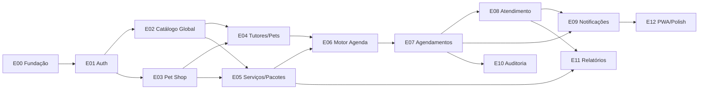

# Épicos — Patafy Care

Especificação BMAD para desenvolvimento incremental. Cadeia: **PRD → Arquitetura → Épicos**.

## Documentação de referência

| Documento | Caminho |
| --- | --- |
| PRD | `docs/PRD.md` |
| Arquitetura | `docs/Arquitetura.md` |
| Modelo de Domínio | `docs/Modelo-de-Dominio.md` |
| Config JSON da loja | `docs/schemas/petshop-config-json.ts` |

## Decisões de produto (fechadas)

| # | Tema | Decisão |
| --- | --- | --- |
| 1 | Admin sistema | Terceiro app **`web-admin`** (React + Vite + Park UI) |
| 2 | Descoberta de lojas | MVP: listar todas ativas; filtros por **cidade**, **estado**, **nome**; acesso direto por **slug** em `config_json`; sem geolocalização no MVP — campos `latitude`/`longitude` nullable em `PetShop` para evolução |
| 3 | Login telefone | **Fora do MVP** (só e-mail/senha + Google) |
| 4 | CPF owner/staff | **Obrigatório** (como tutores) |
| 5 | Cadastro tutor pelo atendente | **E-mail** com link de definição de senha (Firebase password reset) |
| 6 | Relatórios financeiros | **Entra no MVP** |
| 7 | Categorias de serviço | Nova tabela **`CategoriaServico`** |
| 8 | E-mail transacional | **Resend** |
| 9 | Venda pacote personalizável | **Wizard** no `web-petshop` (serviços + quantidades + desconto %) |
| 10 | Não compareceu | **Status separado:** `NaoCompareceu` (não mapear para `Cancelado`) |

## Apps do monorepo

| App | Público |
| --- | --- |
| `web-tutor` | Tutores (B2C) |
| `web-petshop` | Owner, atendente, banhista |
| `web-admin` | Administrador do sistema |
| `api` | Fastify + GraphQL Yoga + Prisma |
| `worker` | Outbox Resend + jobs periódicos |

## Ordem de implementação



## Índice de épicos

| ID | Arquivo | Resumo |
| --- | --- | --- |
| E00 | [E00-fundacao-plataforma.md](./E00-fundacao-plataforma.md) | Monorepo Nx, 3 SPAs, API, worker, Prisma |
| E01 | [E01-autenticacao-identidade-rbac.md](./E01-autenticacao-identidade-rbac.md) | Firebase, perfis, RBAC, CPF obrigatório |
| E02 | [E02-catalogo-global.md](./E02-catalogo-global.md) | TipoAnimal, Raça, Porte, Pelagem (`web-admin`) |
| E03 | [E03-pet-shop-configuracao.md](./E03-pet-shop-configuracao.md) | Onboarding loja, slug, equipe, config_json |
| E04 | [E04-tutores-pets.md](./E04-tutores-pets.md) | Tutores globais, pets, convites, cadastro assistido |
| E05 | [E05-servicos-pacotes.md](./E05-servicos-pacotes.md) | Serviços, categorias, pacotes, wizard de venda |
| E06 | [E06-motor-agenda.md](./E06-motor-agenda.md) | Disponibilidade, slots, anti double-booking |
| E07 | [E07-agendamentos.md](./E07-agendamentos.md) | Marcação, estados, slug, `.ics`, `NaoCompareceu` |
| E08 | [E08-atendimento-operacional.md](./E08-atendimento-operacional.md) | Execução, débito pacote, observações |
| E09 | [E09-notificacoes-email.md](./E09-notificacoes-email.md) | Outbox + Resend (4 eventos MVP) |
| E10 | [E10-auditoria.md](./E10-auditoria.md) | RegistroOperacional append-only |
| E11 | [E11-relatorios-financeiros.md](./E11-relatorios-financeiros.md) | Contabilização por intervalo (owner) |
| E12 | [E12-pwa-performance.md](./E12-pwa-performance.md) | PWA, performance, polish transversal |

## Prompt para agente de desenvolvimento

```
Contexto: Patafy Care — monorepo Nx (api, worker, web-tutor, web-petshop, web-admin).
Stack: Fastify + GraphQL Yoga + Prisma + PostgreSQL + Firebase Auth + Resend.
Docs: docs/PRD.md, docs/Arquitetura.md, docs/Modelo-de-Dominio.md, docs/epicos/<épico>.md
Épico atual: [ID — nome]
Dependências concluídas: [lista]
Entregar: código + testes + migração Prisma quando aplicável
Não implementar: itens marcados "Fora do escopo" no épico
```
